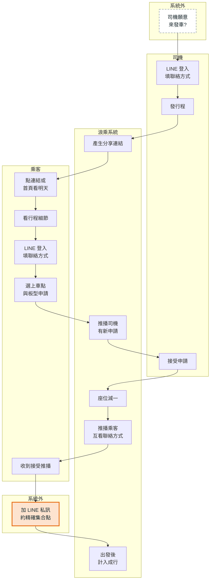
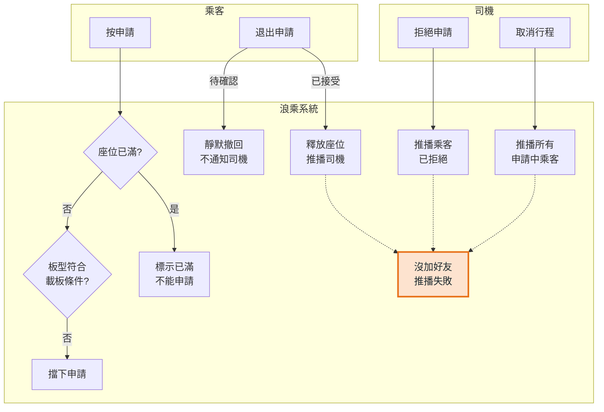

# 浪乘 使用者流程（草稿 v1）

基準：MVP 現況 · 2026-11-13 · 依 Issue #1 與 `src/` 繪製

圖例：
- 實線框：系統裡已經有的步驟
- **虛線框＋`?`**：我推測的、系統外的行為，待你確認
- **橘色**：流程在系統裡斷掉的地方（本圖唯一重點）

## 圖一：主流程（從發車到成行）

```mermaid
%%{init: {"themeVariables": {
  "fontFamily": "\"Noto Sans TC\",\"Microsoft JhengHei\",\"PingFang TC\",sans-serif",
  "fontSize": "18px"
}}}%%
flowchart TB
  subgraph D["司機"]
    direction LR
    D1["LINE 登入<br/>填聯絡方式"] --> D2["發行程"]
    D3["接受申請"]
  end
  subgraph X1L["系統外"]
    direction LR
    X1["司機願意<br/>來發車?"]
  end
  subgraph S["浪乘系統"]
    direction LR
    S1["產生分享連結"]
    S2["推播司機<br/>有新申請"]
    S3["座位減一"]
    S4["推播乘客<br/>互看聯絡方式"]
    S5["出發後<br/>計入成行"]
  end
  subgraph P["乘客"]
    direction LR
    P1["點連結或<br/>首頁看明天"] --> P2["看行程細節"] --> P3["LINE 登入<br/>填聯絡方式"] --> P4["選上車點<br/>與板型申請"]
    P5["收到接受推播"]
  end
  subgraph X2L["系統外"]
    direction LR
    X2["加 LINE 私訊<br/>約精確集合點"]
  end

  X1 --> D1
  D2 --> S1 --> P1
  P4 --> S2 --> D3 --> S3 --> S4 --> P5 --> X2 --> S5

  classDef guess stroke-dasharray: 6 4,fill:#ffffff,stroke:#5d6f76,color:#1d2b30
  classDef gap fill:#fde3cf,stroke:#e8711a,stroke-width:3px,color:#1d2b30
  class X1 guess
  class X2 gap
```

## 圖二：例外路徑（沒成行的分支）

```mermaid
%%{init: {"themeVariables": {
  "fontFamily": "\"Noto Sans TC\",\"Microsoft JhengHei\",\"PingFang TC\",sans-serif",
  "fontSize": "18px"
}}}%%
flowchart TB
  subgraph P["乘客"]
    direction LR
    PA["按申請"]
    PW["退出申請"]
  end
  subgraph S["浪乘系統"]
    direction LR
    F{"座位已滿?"}
    B{"板型符合<br/>載板條件?"}
    FX["標示已滿<br/>不能申請"]
    BX["擋下申請"]
    SR["推播乘客<br/>已拒絕"]
    SC["推播所有<br/>申請中乘客"]
    WA["釋放座位<br/>推播司機"]
    WP["靜默撤回<br/>不通知司機"]
    NF["沒加好友<br/>推播失敗"]
  end
  subgraph D["司機"]
    direction LR
    DR["拒絕申請"]
    DC["取消行程"]
  end

  PA --> F
  F -- 是 --> FX
  F -- 否 --> B
  B -- 否 --> BX
  DR --> SR
  DC --> SC
  PW -- 已接受 --> WA
  PW -- 待確認 --> WP
  SR -.-> NF
  SC -.-> NF
  WA -.-> NF

  classDef gap fill:#fde3cf,stroke:#e8711a,stroke-width:3px,color:#1d2b30
  class NF gap
```
